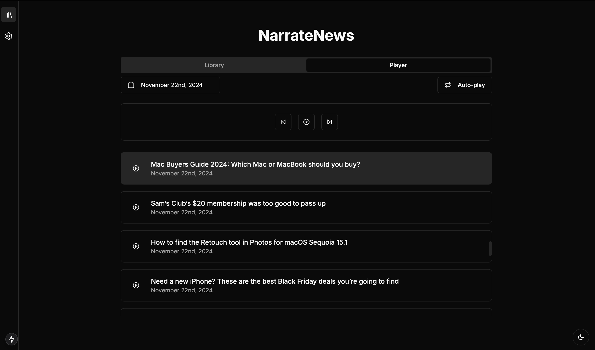
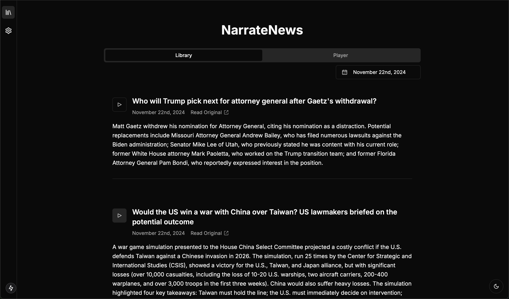

NarrateNews: A News Summarization and Audio Conversion Application

## Overview

NarrateNews is a modern web application designed to fetch news articles from RSS feeds, summarize them using AI models, and convert the summaries to audio files. It features a modern web interface for easy interaction and management of your news library.

## Screenshots





## Current Features

- Fetches news articles from specified RSS feeds
- Summarizes articles using AI models (configurable, default is Gemini Flash 1.5 via OpenRouter)
- Converts summaries to audio files using multiple text-to-speech providers (ElevenLabs and Neets.ai)
- UI:
  - Library 
  - Audio player
  - Settings

## Setup

1. Create a `.env` file in your project directory:


- OPENAI_API_KEY=
- ELEVEN_API_KEY=
- ELEVENLABS_VOICE_ID=
- ANTHROPIC_API_KEY=
- OPENAI_API_KEY=
- NEETS_API_KEY=-
- OPENROUTER_API_KEY=

To start, Use your ElevenLabs or a Neets API key (it's free to start) and an OpenRouter API key (access to most models/providers). 


2. Install Python dependencies: 
```
pip install -r requirements.txt
```
3. Install Node.js dependencies: 
```
cd narrate-news-web
npm install
```

## Running the application: 
```
python start.py
```

This will start both the API server and web interface. The application will be available at:
- Web UI: http://localhost:3000
- API: http://localhost:8000

## Customization

You can customize the application by:
- Modifying RSS feeds in `config.py`
- Adjusting default settings in `config.py`
- Customizing the web interface in the `narrate-news-web` directory

## Disclaimer

This application uses third-party APIs and services (ElevenLabs, Neets.ai, OpenAI, etc.). Ensure you comply with their respective usage policies and terms of service.

## Contributing

Please fork the repository, make your changes, and submit a pull request.

## TODO/ADD
- Add different input types: text, files (.pdf, .txt, etc.)
- Add library search functionality
- Add tagging system
- Add free TTS options
- Add mobile support
- GraphRAG


